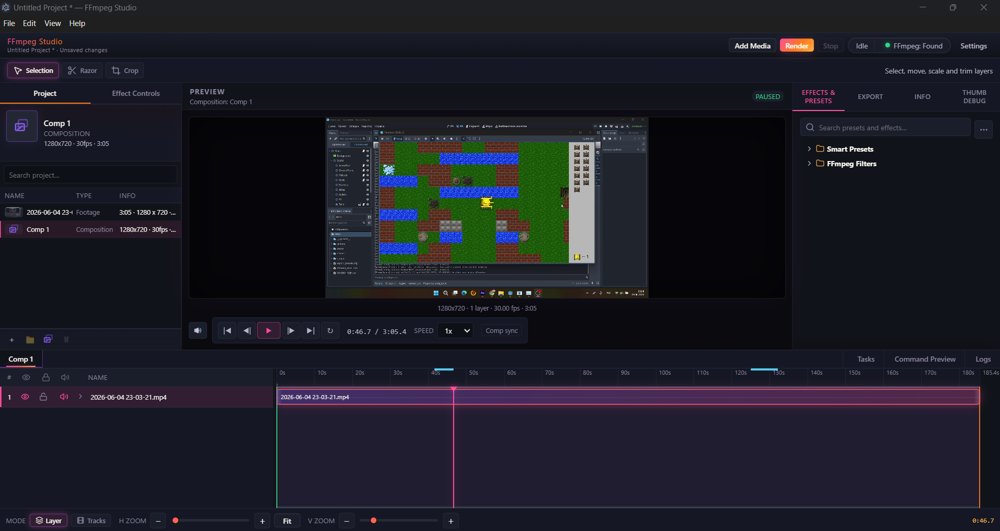
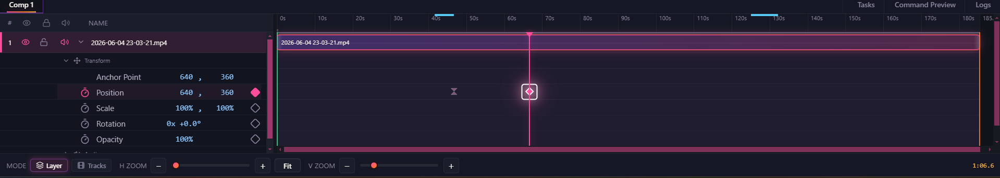
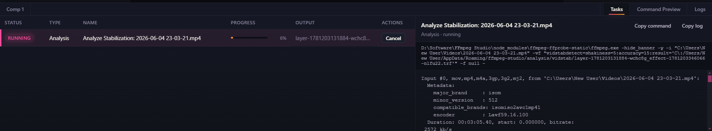
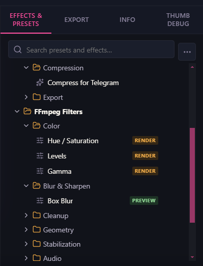
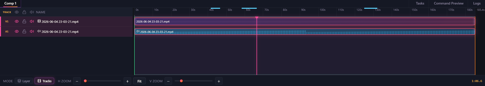

# FFmpeg Studio

**This is an active prototype / work-in-progress.** It is not production-stable.

FFmpeg Studio is an unofficial open-source **visual FFmpeg editor** for filters, preview, timeline organization, and rendering — built on Electron, React, and FFmpeg (via [node-av](https://www.npmjs.com/package/node-av)).

This is **not** an After Effects / Premiere replacement. It is a visual FFmpeg-based workflow for applying filters, previewing footage, organizing layers on a timeline, and exporting through FFmpeg.

This project is **not affiliated with or endorsed by** the FFmpeg project.

## What it is

A desktop studio for filter-based video processing: import footage, browse FFmpeg filters, preview with a native decode engine, organize layers on a timeline, and render through FFmpeg job queues.

Features and APIs change frequently. Expect rough edges, incomplete workflows, and regressions until manual release checks are done.

## First public revision

This repository is the first public revision of FFmpeg Studio.

The goal is to show the direction of the project: a visual FFmpeg editor with filter presets, preview, layer stack timeline, audio playback, and an FFmpeg render pipeline.

It is not a finished product yet. If the project gets interest from users, I plan to continue improving it as a hobby/open-source project and focus on the features people actually need.

## Screenshots

### Main editor



### Timeline preview



### Preview cache / progress ranges



### Effects and presets



### Timeline editing



## Current features

- Import video (drag-and-drop or file picker)
- Project panel and multi-composition timeline
- Layer transforms, crop, effects, and keyframes (work in progress)
- **Preview engine** — node-av / FFmpeg decode in the main process
- **Random-access frame preview** — seek while paused or playing
- Play / pause / scrub with timeline sync
- **Audio preview** — HTML `<audio>` synced to engine playhead
- Preview cache / buffered range indicators on the timeline
- Background FFmpeg jobs — proxy, preview cache, composition render, batch
- **Crash-safe decode** — global decode mutex, single-thread decoder config
- Automated preview regression scripts (selftest, crash-test)

## Tech stack

- **Electron** — desktop shell and IPC
- **React** + **TypeScript** — renderer UI
- **Vite** — dev server and production bundle
- **FFmpeg / ffprobe** — media probe, transcode, render
- **node-av** — native preview decode

## Requirements

- **Windows 10/11 (64-bit)** recommended for packaged builds
- Node.js 18+ and npm (for development / building from source)

## Download

The easiest way to try FFmpeg Studio is to download the latest Windows build from the GitHub Releases page.

Windows 10/11 64-bit is recommended.

## Install (from source)

```bash
npm install
```

## Development

Start the app with hot reload:

```bash
npm run dev
```

On Windows you can also use `start-dev.bat`.

## Quality checks

Typecheck and production bundle:

```bash
npm run check
```

## Build (from source)

Packaging copies FFmpeg from the `ffmpeg-ffprobe-static` npm package into `resources/bin/` automatically:

```bash
npm run prepare:ffmpeg-bin
```

```bash
npm run build
```

Windows distributables:

```bash
npm run dist              # portable + installer
npm run dist:portable     # portable .exe only
npm run dist:installer    # NSIS installer only
```

Output appears in `release/`.

### Publish a release

1. Run `npm run dist` (or `dist:portable` / `dist:installer`).
2. On GitHub: **Releases → Draft a new release** → attach artifacts from `release/` (portable `.exe`, installer).
3. Do not commit `release/` artifacts to git.

## Preview regression tests

These launch Electron headlessly, import a test MP4, exercise preview, and write JSON results under `tmp/`.

**Selftest** (human-paced flow: seek, play, pause, audio checks):

```powershell
$env:PREVIEW_SELFTEST_FILE="C:\path\to\video.mp4"
npm run preview:selftest
```

**Crash test** (stress overlapping decode paths; use light mode for CI / low RAM):

```powershell
$env:PREVIEW_CRASH_TEST_FILE="C:\path\to\video.mp4"
npm run preview:crash-test:light
```

Both require a real local MP4. Do not expect PASS without setting the env variable.

Optional engine dev diagnostics in the UI:

```bash
VITE_ENGINE_PREVIEW_DEV_DIAG=1 npm run dev
```

## FFmpeg resolution

When **Auto** is selected in Settings, FFmpeg is resolved in order:

1. Custom path from Settings
2. Bundled binaries in `resources/bin` (packaged releases)
3. `ffmpeg-ffprobe-static` npm package (development)
4. System `PATH`

Both `ffmpeg` and `ffprobe` are verified with `-version` before use.

## Known limitations

- Crash-test may require enough RAM and a real local MP4; headless Electron can OOM before import completes
- Export pipeline is still under development
- Audio/video sync may need more testing on different files
- Old preview/proxy infrastructure may still exist internally
- Project is under active development — APIs and UI will change

## Possible next features

- More stable export presets
- Better audio/video sync tools
- More FFmpeg filter UI controls
- Timeline editing improvements
- Preview performance improvements
- Project save/load polishing
- User-requested workflows

## Support development

FFmpeg Studio is currently developed as a personal open-source prototype.

If you find the project interesting, you can support it by:

- starring the repository
- sharing feedback or bug reports
- suggesting useful editing features
- testing the app with different video files
- supporting future development through donations or sponsorship links when available

Support and interest will help decide whether this project continues as a long-term hobby project and which features should be prioritized next.

## License

FFmpeg Studio is licensed under [GNU General Public License v3.0 or later](LICENSE).

## Disclaimer

FFmpeg is a trademark of Fabrice Bellard. FFmpeg Studio is an unofficial GUI project.

See [docs/legal/THIRD_PARTY_NOTICES.md](docs/legal/THIRD_PARTY_NOTICES.md) for third-party components.
