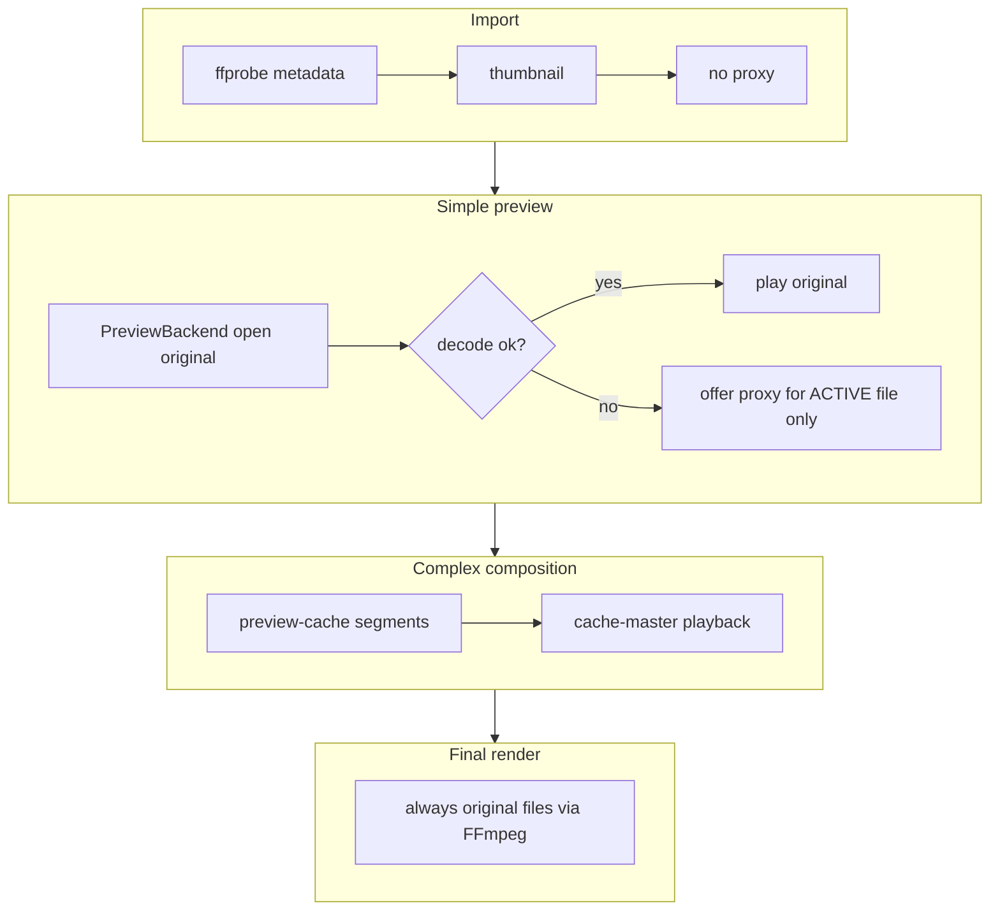

# Preview Backend Research — FFmpeg Studio

**Дата:** 2026-06-09  
**Тип:** Architecture spike (read-only по коду приложения; файлы проекта не менялись)  
**Лицензия проекта:** GPL-3.0-or-later  
**Целевая платформа (v1):** Windows + Electron 33

---

## Summary

Текущий preview в FFmpeg Studio построен на Chromium `<video>` (по одному элементу на видимый слой). Это даёт быстрый путь для «простого» H.264/yuv420p, но ломается на части MP4 (типичная ошибка: `Unsupported pixel format: -1` — Chromium не понимает pixel format исходника). Сейчас это компенсируется **auto proxy при import** (`finalizeImportedFootage` → `runNativePreviewCheck` → `handleCreatePreviewProxy`), что противоречит целевой архитектуре: proxy должен быть **fallback только для active file**, а не массовая конвертация при импорте.

**Рекомендация:** внедрить **native FFmpeg/libav decoder в main process** (пакет [`node-av`](https://github.com/seydx/node-av)) как основной preview engine для simple footage / single-layer playback. Chromium `<video>` оставить **fast-path fallback** для совместимых файлов. Proxy — **только по запросу** после явного сбоя backend на активном файле.

Для **complex composition** (несколько слоёв, эффекты, precomp) — сохранить и развивать существующий **preview-cache по сегментам** (`preview-cache` jobs), а не whole-file proxy.

**Не рекомендуется** как primary: VLC/libvlc (устаревшие Electron-биндинги, проблемы с Electron 33). **libmpv** — сильный кандидат для ускоренного spike/Plan B, но дублирует FFmpeg-стек и усложняет дистрибуцию; для GPL-проекта приемлем, но хуже стыкуется с философией «FFmpeg — сильная сторона».

---

## Текущее состояние (as-is)

### Поток import → preview

```
importMediaFiles
  → ffprobe (IPC ffmpeg:probe)
  → thumbnail
  → finalizeImportedFootage
       → runNativePreviewCheck (hidden <video> в renderer)
       → если fail + autoCreatePreviewProxy → handleCreatePreviewProxy (FFmpeg transcode)
```

Ключевые файлы:

| Область | Файлы |
|---------|-------|
| Композитор preview | `src/renderer/components/VideoPreview.tsx` |
| `<video>` на слой | `src/renderer/components/CompositionPreviewLayer.tsx`, `PrecompPreviewLayer.tsx` |
| State machine путей | `src/media/mediaCompatibility.ts`, `src/media/previewState.ts` |
| HTML video probe | `src/media/mediaPostImport.ts`, `src/media/nativePreviewTest.ts` |
| Sync modes | `src/renderer/utils/previewPlayback.ts` |
| Proxy generation | `src/ffmpeg/previewProxyBuilder.ts`, `src/renderer/App.tsx` |
| Complex comp cache | `src/ffmpeg/previewCacheBuilder.ts`, `preview-cache` jobs |

### Режимы playback (`previewPlayback.ts`)

| Режим | Когда | Движок |
|-------|-------|--------|
| `video-master` | 1 видимый video layer | `<video>` master clock |
| `composition-clock` | Несколько слоёв / нет master | RAF + seek `<video>` |
| `cache-master` | Preview cache готов | Один `<video>` на cache segment |

### Проблемы as-is

1. **N×`<video>`** — по элементу на каждый видимый слой; при 20 клипах в таймлайне потенциально много декодеров Chromium.
2. **Ограниченный demux/decode Chromium** — не все pixel formats / profiles / 10-bit / некоторые HEVC/ProRes варианты.
3. **Proxy как primary** — при `autoCreatePreviewProxy !== false` каждый failed import запускает FFmpeg transcode (`yuv420p` H.264 proxy).
4. **Probe при import блокирует UX** — `checking-preview` на каждый файл; пользователь ждёт, хотя FFmpeg уже умеет декодировать оригинал.
5. **Дублирование логики** — ffprobe знает pixel format, но решение принимает отдельный HTML video test.

### Целевая схема (to-be)



---

## Сравнительная таблица

| Критерий | **1. libmpv** | **2. libvlc** | **3. Native FFmpeg (node-av)** | **4. Electron `<video>` (fallback)** |
|----------|---------------|---------------|--------------------------------|--------------------------------------|
| **Форматы / codecs** | ★★★★★ (почти всё, что FFmpeg) | ★★★★☆ | ★★★★★ (тот же libav) | ★★☆☆☆ |
| **HW decode (Win)** | ★★★★☆ D3D11VA/DXVA2 через mpv | ★★★★☆ DXVA2/D3D11 | ★★★★☆ D3D11VA/CUDA/QSV через libav | ★★★☆☆ (Chromium codecs) |
| **Electron integration** | ★★☆☆☆ native addon / `--wid` / render API | ★☆☆☆☆ wcjs устарел | ★★★☆☆ main process N-API, IPC frames | ★★★★★ уже есть |
| **Embed в React UI** | ★★★☆☆ render→WebGL canvas или HWND overlay | ★★☆☆☆ WebGL canvas (wcjs) | ★★★☆☆ canvas/WebGL из RGBA или shared texture | ★★★★★ DOM `<video>` |
| **Seek / play / pause** | ★★★★★ | ★★★★★ | ★★★★☆ (своя clock loop) | ★★★★★ |
| **Frame step** | ★★★★★ `frame-step` | ★★★★☆ | ★★★★★ `av_seek_frame` + 1 frame | ★★★☆☆ `currentTime ± 1/fps` (неточно) |
| **Audio** | ★★★★★ встроено | ★★★★★ встроено | ★★★☆☆ отдельный audio output (WASAPI) | ★★★★★ |
| **1 player / N files** | ★★★★★ один mpv instance | ★★★★★ один player | ★★★★★ один decoder session | ★☆☆☆☆ N video elements |
| **Сложность установки** | Средняя (mpv-1.dll + addon) | Высокая (VLC bundle + rebuild) | Средняя (prebuilt node-av) | Нулевая |
| **Актуальность npm** | mpv.js (PPAPI, мёртв); node-mpv (IPC, живой) | wcjs-prebuilt (2016–2021, Electron mismatch) | node-av (2024–2025, Electron examples) | встроено |
| **Лицензия / GPL проект** | GPLv2+ builds OK для GPL-3; LGPL build возможен | LGPL-2.1 core OK | LGPL libav OK (зависит от build FFmpeg) | N/A |
| **Стыковка с FFmpeg render** | Дублирует FFmpeg внутри mpv | Дублирует свой stack | **Прямая** — тот же семейство API | Нет |
| **Риск для Windows v1** | HWND embedding глючит с transparency | Высокий — broken на новых Electron | Средний — IPC bandwidth / GPU path | Низкий, но функционально недостаточен |

---

## Детальный разбор вариантов

### 1. mpv / libmpv

#### Как подключается к Electron

Три пути (от простого к правильному):

| Путь | Описание | Оценка |
|------|----------|--------|
| **A. node-mpv JSON IPC** | Main spawn `mpv.exe --idle --input-ipc-server=...`, команды `loadfile`, `seek`, события `time-pos` | Быстрый spike; отдельный процесс; не встраивается в React напрямую |
| **B. `--wid=<HWND>`** | `BrowserWindow.getNativeWindowHandle()` → child video surface | Плохо для layered UI (crop overlays, transform gizmos); прозрачность Electron ломает embedding |
| **C. libmpv Render API** | `mpv_render_context_create` + OpenGL/D3D → RGBA/WebGL texture в canvas | **Правильный** путь для React; сложнее |

Рекомендуемые пакеты для spike:

- [`node-mpv@beta`](https://www.npmjs.com/package/node-mpv) — IPC wrapper (Plan B spike)
- [`mpv.js`](https://github.com/Kagami/mpv.js) — PPAPI plugin (**не подходит** для Electron 33)
- Custom N-API addon + `mpv-dev` headers + `mpv-1.dll` (production path для Render API)

#### React UI

- Render API: canvas/WebGL в `VideoPreview` compositor; UI overlays (crop, gizmos, safe margins) остаются DOM поверх canvas.
- `--wid`: mpv перекрывает весь HWND — **не подходит** для NLE-style compositor.

#### Возможности

| Функция | Поддержка |
|---------|-----------|
| Seek / play / pause | ✅ IPC / property `time-pos`, `pause` |
| Frame step | ✅ `frame-step` / `frame-back-step` |
| Audio | ✅ нативно в mpv |
| HW decode | ✅ `--hwdec=auto` (D3D11VA, DXVA2, NVDEC) |
| Multiple files | ✅ один instance, swap `loadfile` |

#### Установка (Windows)

1. Скачать `mpv-dev` / `mpv-1.dll` (shinchiro / lachs0r builds).
2. Положить DLL рядом с `.exe` или в `resources/bin`.
3. N-API addon или внешний `mpv.exe` через node-mpv.

#### Лицензия

- mpv core: **GPLv2+** по умолчанию — совместимо с GPL-3.0 проектом.
- Возможен LGPL build (`-Dgpl=false`), но с урезанным VO/HW.
- API headers: ISC.

#### Вердикт

**Сильный decode engine, слабая интеграция в layered compositor.** Хорош для «play one file in footage viewer». Для composition с transform/crop/effects поверх видео — нужен Render API → texture, не HWND. Дублирует FFmpeg, который уже central в проекте.

---

### 2. VLC / libvlc

#### Как подключается к Electron

Исторический стек:

- [`webchimera.js`](https://github.com/RSATom/WebChimera.js) + [`wcjs-prebuilt`](https://www.npmjs.com/package/wcjs-prebuilt)
- Рендер: raw frame buffer → WebGL canvas (`wcjs-renderer`)

#### Проблемы

- Prebuilt бинарники рассчитаны на **Electron 0.3x–1.x**; wiki явно указывает **compatibility issues с latest Electron on Windows**.
- Последняя активность wcjs — 2016–2021; **4 weekly downloads**.
- Bundled libvlc ≈ **100+ MB** в дистрибутив.
- Тот же framebuffer→canvas путь, что и у libav, но с **чужим** stack.

#### Возможности

| Функция | Поддержка |
|---------|-----------|
| Seek / play / pause | ✅ |
| Frame step | ✅ (с оговорками по точности) |
| Audio | ✅ |
| HW decode | ✅ DXVA2/D3D11 |
| React embed | ★★☆ WebGL canvas only |

#### Лицензия

- libvlc: **LGPL-2.1** — совместимо с GPL-3 (dynamic link + attribution).
- Некоторые VLC plugins — GPL.

#### Вердикт

**Не рекомендуется.** Высокий риск maintenance на Electron 33, устаревшие bindings, нет преимущества перед node-av/libmpv.

---

### 3. Native FFmpeg / libav decoder (node-av)

#### Как подключается к Electron

```
Main process (node-av)
  Decoder + HardwareContext(D3D11VA)
  → scaled preview frames (e.g. 1280px wide, RGBA or NV12)
  → IPC: SharedArrayBuffer / MessagePort / DXGI shared handle (v2)
Renderer
  PreviewCanvas (WebGL / OffscreenCanvas)
  → composite with CSS transforms, effects, overlays
```

Пакет: [`node-av`](https://github.com/seydx/node-av) v5.x

- Prebuilt binaries **ABI-compatible с Electron** (не нужен electron-rebuild для базового случая).
- Примеры: `examples/electron/builder`, `examples/electron/forge`.
- `SharedTexture` (v5.2+) — zero-copy GPU import из Electron offscreen texture (для encode; обратный путь decode→display требует проектирования).

#### React UI

- Новый компонент `PreviewCanvas` внутри `VideoPreview` вместо `<video>` для footage/simple path.
- `CompositionPreviewLayer` для native path рисует **текстуру одного active decoder**, не создаёт `<video>`.
- Overlays (crop, gizmos) — без изменений, DOM поверх canvas.

#### Возможности

| Функция | Поддержка |
|---------|-----------|
| Seek | ✅ `av_seek_frame` + flush |
| Play / pause | ✅ decode loop в main, clock в main или renderer |
| Frame step | ✅ decode 1 frame at `pts ± 1/fps` — **лучше для NLE** |
| Audio | ⚠️ Отдельно: libav audio decode + WASAPI (node-native-audio / naudiodon) или временно mute в v1 |
| HW decode | ✅ `AV_HWDEVICE_TYPE_D3D11VA` на Windows |
| Formats | ✅ Всё, что в bundled FFmpeg (включая проблемные pixel formats) |

#### Установка (Windows)

```bash
npm install node-av
```

- Проверить совместимость версии FFmpeg в node-av vs `ffmpeg-ffprobe-static` (разные builds возможны; для preview допустим отдельный runtime).
- `electron-builder.json` — `extraResources` для native `.node` + DLL.

#### Лицензия

- node-av: MIT.
- FFmpeg libs: **LGPL-2.1+** при dynamic link (типичный prebuilt) — OK для GPL-3 проекта.
- Текущий `ffmpeg-ffprobe-static` — GPL build; **final render CLI остаётся как есть**; preview decoder может использовать LGPL node-av build без конфликта, если не линковать статически в один binary с GPL-only flags.

#### Вердикт

**Рекомендуемый primary backend.** Максимальное совпадение с render pipeline, полный контроль, один decoder session на active source, решает `pixel format: -1` без proxy.

**Главный engineering challenge:** доставка кадров main→renderer без убийства IPC:

| Фаза | Подход | Bandwidth @ 720p RGBA 24fps |
|------|--------|----------------------------|
| v1 spike | Downscale 960×540 + JPEG keyframes / RGBA только при pause | Приемлемо |
| v1.5 | SharedArrayBuffer ring buffer, 2–3 буфера | ~50–80 MB/s — на грани |
| v2 | D3D11 shared texture → WebGL import (custom native bridge) | GPU zero-copy |

---

### 4. Electron `<video>` (fallback only)

#### Роль в to-be

**Не primary.** Использовать когда:

- `node-av` backend disabled / failed init;
- файл уже proven compatible (H.264 + yuv420p + baseline/main);
- optional fast path: ffprobe heuristic → skip native backend, use `<video>` directly.

#### Что сохранить

- `CompositionPreviewLayer` / `PrecompPreviewLayer` как `HtmlVideoPreviewLayer`.
- `nativePreviewTest.ts` → переименовать концептуально в `htmlVideoCompatibilityProbe` (только fallback path, **не при import**).

#### Вердикт

Оставить как **Tier-2 fallback**, убрать из import critical path.

---

## Рекомендуемая архитектура

### Принцип

> **Proxy — fallback, не preview engine.** Import = ffprobe + thumbnail. Decode original on demand.

### Слои

```
┌─────────────────────────────────────────────────────────────┐
│ Renderer: VideoPreview.tsx                                   │
│  ├─ PreviewCompositor (DOM overlays: crop, gizmos, effects) │
│  ├─ PreviewCanvas (WebGL / native backend frames)           │
│  └─ HtmlVideoPreviewLayer (fallback, lazy)                  │
├─────────────────────────────────────────────────────────────┤
│ Preload: preview:* IPC                                       │
├─────────────────────────────────────────────────────────────┤
│ Main: PreviewService                                         │
│  ├─ NativeAvPreviewBackend (node-av) ← PRIMARY             │
│  ├─ HtmlVideoFallbackAdapter (optional passthrough)         │
│  └─ single session: { activeSourcePath, decoder, clock }    │
├─────────────────────────────────────────────────────────────┤
│ Existing: preview-cache jobs (complex comp)                  │
│ Existing: previewProxyBuilder (manual fallback only)       │
│ Existing: compositionRenderBuilder (final render, originals)│
└─────────────────────────────────────────────────────────────┘
```

### Routing по сценарию

| Сценарий | Backend | Proxy |
|----------|---------|-------|
| Import 20 файлов | ffprobe + thumb only | ❌ |
| Footage preview (1 file) | node-av → original | только если backend fail + user confirm |
| Comp: 1 video layer | node-av + CSS transform/effects | то же |
| Comp: 2+ layers / heavy effects | `preview-cache` segment | ❌ per-file proxy |
| Frame step (Ctrl+Arrow) | libav exact frame | — |
| Final render | FFmpeg originals | ❌ никогда |

### Изменения в import flow (будущее)

**Убрать:**

```typescript
// App.tsx finalizeImportedFootage — сегодня:
runNativePreviewCheck → auto proxy
```

**Заменить на:**

```typescript
// import complete:
compatibilityStatus: "imported"  // или "preview-ready"
previewPath: originalPath
// native check — lazy, при первом open в preview / по кнопке Play
```

### Sync modes (эволюция)

| Текущий | Будущий |
|---------|---------|
| `video-master` + `<video>` | `backend-master` + NativeAv clock |
| `composition-clock` + N video | `composition-clock` + 1 backend OR cache |
| `cache-master` | без изменений |

---

## Implementation plan

### Phase 0 — Spike (безопасный, вне prod code) ✅ рекомендуется первым

Создать `scripts/preview-spike/` (или отдельная ветка):

1. `decode-smoke-test.ts` — node-av открывает проблемный MP4, декодирует 30 кадров, логирует pixel format.
2. `bench-ipc.ts` — замер RGBA 960×540 @ 24fps через MessagePort.
3. Опционально: `mpv-ipc-test.ts` — node-mpv load + seek на том же файле.

**Критерий успеха:** problem file декодируется без `pixel format: -1`; IPC latency < 16ms p95 при downscaled RGBA.

### Phase 1 — PreviewService skeleton (MVP)

1. `src/main/preview/PreviewService.ts` — single session, play/pause/seek/open/close.
2. IPC: `preview:open`, `preview:play`, `preview:pause`, `preview:seek`, `preview:stepFrame`, `preview:close`, event `preview:frame`.
3. `src/renderer/components/PreviewCanvas.tsx` — WebGL blit RGBA.
4. Feature flag: `settings.previewBackend = 'native' | 'html'`.

**Scope MVP:** footage tab / single visible layer only; audio muted или через `<audio>` fallback позже.

### Phase 2 — Integrate VideoPreview

1. `VideoPreview.tsx` — routing: native vs html vs cache.
2. `CompositionPreviewLayer.tsx` — split: `NativePreviewLayer` / `HtmlVideoPreviewLayer`.
3. Убрать auto proxy из `finalizeImportedFootage`.
4. UI: «Create preview proxy» только для **selected/active** footage при `previewError`.

### Phase 3 — Audio + HW optimize

1. Audio: WASAPI output в main или pass PCM to renderer AudioWorklet.
2. GPU: D3D11 decode → shared handle → WebGL (если IPC bottleneck подтверждён).
3. Frame-accurate sync с timeline keyframes.

### Phase 4 — Complex composition

1. Расширить preview-cache: **segment-based** invalidation (не whole comp).
2. Multi-layer: cache master OR future GPU compositor (out of scope v1).

### Файлы для изменения (будущие PR)

| Файл | Изменение |
|------|-----------|
| `package.json` | + `node-av` |
| `electron-builder.json` | bundle native binaries |
| `src/main/ipc.ts` | preview IPC handlers |
| `src/main/preload.ts` | expose `preview.*` |
| `src/main/preview/PreviewService.ts` | **новый** |
| `src/main/preview/NativeAvPreviewBackend.ts` | **новый** |
| `src/renderer/components/PreviewCanvas.tsx` | **новый** |
| `src/renderer/components/VideoPreview.tsx` | backend routing |
| `src/renderer/components/CompositionPreviewLayer.tsx` | native/html split |
| `src/renderer/utils/previewPlayback.ts` | `backend-master` mode |
| `src/media/mediaCompatibility.ts` | убрать proxy-centric statuses из import |
| `src/media/mediaPostImport.ts` | удалить/перенести import-time HTML probe |
| `src/renderer/App.tsx` | `finalizeImportedFootage` — no auto proxy |
| `src/shared/settings.ts` | `previewBackend`, `autoCreatePreviewProxy` default false |

**Не трогать в Phase 1–2:**

- `src/ffmpeg/compositionRenderBuilder.ts` (final render)
- `src/ffmpeg/previewProxyBuilder.ts` (оставить для manual fallback)
- `preview-cache` pipeline (только документировать роль)

---

## Risks

| Риск | Severity | Mitigation |
|------|----------|------------|
| IPC bandwidth main→renderer | High | Downscale preview; ring buffer; GPU shared texture v2 |
| Audio sync complexity | Medium | MVP: mute / separate milestone |
| node-av FFmpeg vs ffmpeg-ffprobe-static version drift | Medium | Pin versions; document two FFmpeg runtimes (CLI vs preview libs) |
| Electron ABI break on upgrade | Medium | Lock Electron + node-av versions; CI smoke test |
| Multi-layer compositing без cache | High | Keep preview-cache for 2+ layers; не блокировать Phase 1 |
| LGPL/GPL compliance | Low | Dynamic link node-av; ship LICENSE notices; не static link GPL ffmpeg into preview addon |
| Regression на «простых» MP4 | Medium | HTML fallback path + feature flag |
| Development time > mpv IPC shortcut | Medium | Phase 0 bench; если IPC unsolvable — Plan B libmpv Render API |

---

## First safe step

**Сделать Phase 0 spike в `scripts/preview-spike/`** (не трогая `src/`):

1. `npm install node-av --no-save` в spike script или devDependency в отдельном PR.
2. Взять **реальный problem file** из bug report (`Unsupported pixel format: -1`).
3. Запустить decode smoke test из **Electron main** (не browser):
   ```bash
   npx electron scripts/preview-spike/decode-smoke-test.mjs path/to/problem.mp4
   ```
4. Зафиксировать: codec, pix_fmt, hwaccel, ms/frame.
5. Если pass → PR «Add PreviewService skeleton» (Phase 1) за feature flag.

**Не делать сейчас:**

- ❌ Менять `finalizeImportedFootage` / auto proxy
- ❌ Переписывать `VideoPreview.tsx`
- ❌ Добавлять mpv.dll / libvlc в production bundle без spike

---

## Proof-of-concept status

**POC в production code не создавался** (по требованию spike: «ничего не ломать»).

Безопасный POC = Phase 0 script в `scripts/preview-spike/` в отдельном PR после approval этого документа.

---

## Итоговая рекомендация

| Роль | Выбор |
|------|-------|
| **Primary preview backend** | Native FFmpeg via **node-av** (main process) |
| **Complex comp preview** | Существующий **preview-cache** (segment render) |
| **Fallback #1** | Electron `<video>` (heuristic compatible formats) |
| **Fallback #2** | Manual **proxy for active file only** (`previewProxyBuilder`) |
| **Final render** | Originals via FFmpeg (**без изменений**) |
| **Отклонить** | VLC/wcjs; auto proxy on import; N×`<video>` как primary |

**Почему node-av, а не mpv:** FFmpeg Studio уже строится вокруг FFmpeg для probe, proxy, cache, render. Единый libav decode stack для preview даёт предсказуемость pixel formats, переиспользование ffprobe metadata, frame-accurate stepping и не добавляет третий media stack (Chromium + FFmpeg CLI + mpv-internal-ffmpeg). mpv остаётся разумным **Plan B**, если GPU display path через node-av окажется слишком дорогим в разработке.

---

## References

- [mpv libmpv Render API](https://github.com/mpv-player/mpv-examples/tree/master/libmpv)
- [mpv render_gl.h — HW decoding notes (ANGLE on Windows)](https://github.com/mpv-player/mpv/blob/master/include/mpv/render_gl.h)
- [node-av — Electron + HW decode + SharedTexture](https://github.com/seydx/node-av)
- [Electron offscreen shared texture](https://www.electronjs.org/docs/latest/tutorial/offscreen-rendering)
- [WebChimera.js Electron compatibility issues](https://github.com/RSATom/WebChimera.js/wiki)
- [FFmpeg D3D11VA hwaccel](https://www.ffmpeg.org/doxygen/7.1/structAVD3D11VAContext.html)
